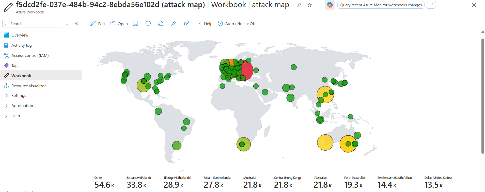
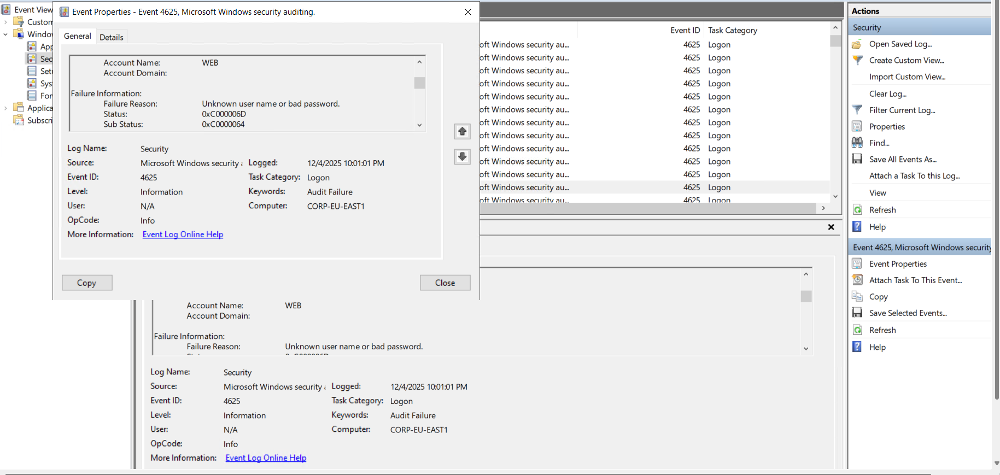

# Azure Sentinel SIEM Honeypot Lab

I deployed a deliberately vulnerable Windows 10 VM on Azure and used Microsoft Sentinel to monitor real attacks hitting it. Within hours, I was seeing failed login attempts from all over the world.

## What I Built

**The Setup:**
- Windows 10 VM with firewall off and NSG allowing all inbound traffic (basically screaming "hack me")
- Azure Monitor Agent forwarding security logs to Log Analytics Workspace
- Microsoft Sentinel as the SIEM
- GeoIP database (54k+ IP ranges) to map attacker locations
- Custom workbook to visualize attacks on a map

**Architecture Flow:**
```
Attackers → Honeypot VM → Azure Monitor Agent → Log Analytics → Sentinel → Attack Map
```

## Technical Details

**Cloud Infrastructure:**
- Azure VM (Windows 10)
- Network Security Group with allow-all inbound rule
- Log Analytics Workspace for log aggregation
- Sentinel SIEM instance
- Windows Security Events via AMA connector

**Detection & Analysis:**
- Monitored Event ID 4625 (failed login attempts)
- Enriched logs with GeoIP data via Sentinel Watchlist
- Wrote KQL queries to analyze attack patterns
- Built workbook for geographic visualization



## What I Found

The VM got hit almost immediately. Automated bots constantly trying common usernames (Administrator, employee, root, user) with brute force attacks on RDP. Attacks came from everywhere - clear evidence of global bot networks scanning for vulnerable systems.

Most interesting part: seeing how fast vulnerable systems get discovered. This wasn't targeted - just automated scanning finding an exposed RDP port and going to town on it.

## KQL Queries I Used

**Basic failed login detection:**
```kql
SecurityEvent
| where EventID == 4625
| project TimeGenerated, Account, IpAddress, Computer
| order by TimeGenerated desc
```

**Failed logins with location data:**
```kql
let GeoIPDB_FULL = _GetWatchlist("geoip");
SecurityEvent
| where EventID == 4625
| where TimeGenerated > ago(24h)
| evaluate ipv4_lookup(GeoIPDB_FULL, IpAddress, network)
| project TimeGenerated, Account, IpAddress, country, latitude, longitude
| order by TimeGenerated desc
```

**Attack summary by country:**
```kql
let GeoIPDB_FULL = _GetWatchlist("geoip");
SecurityEvent
| where EventID == 4625
| evaluate ipv4_lookup(GeoIPDB_FULL, IpAddress, network)
| summarize FailedAttempts = count() by country
| order by FailedAttempts desc
```

**Most targeted usernames:**
```kql
SecurityEvent
| where EventID == 4625
| summarize AttemptCount = count() by TargetUserName
| order by AttemptCount desc
| take 10
```

## Skills Applied

- Azure cloud infrastructure (VMs, NSGs, resource management)
- SIEM configuration and log forwarding
- KQL query writing for security investigations
- Threat intelligence enrichment
- Security event analysis (Windows Event IDs)
- Workbook development for visualization

## What I Learned

**Log enrichment matters.** Raw IP addresses don't tell you much. Adding geographic data and threat context makes analysis way more effective.

**KQL is powerful.** Coming from a DevOps background, picking up KQL wasn't too different from other query languages. The ability to quickly filter and correlate thousands of log entries is crucial for security work.

**Everything gets scanned constantly.** Put something vulnerable on the internet and it gets found within minutes. Really drives home why proper hardening and monitoring are non-negotiable.

**SIEM architecture understanding.** Got hands-on with the full pipeline: log collection → aggregation → enrichment → querying → visualization. This is the foundation of how SOC teams operate.



## Cost & Cleanup

Ran this for about 24-48 hours. Total cost was around $3-5 depending on VM size and log ingestion volume. Shut down the VM when not monitoring and deleted everything after completion to avoid surprise charges.

## What's Next

- Add analytics rules for automated alerting
- Create incident response playbooks
- Deploy Linux honeypot for comparison
- Map detections to MITRE ATT&CK framework
- Build automation with Logic Apps

## Why This Project

I'm transitioning from DevOps to security roles (IAM, Security Engineering). This project shows I can:
- Work with enterprise security tools (Sentinel/SIEM)
- Analyze security events and detect threats
- Write queries for investigation (KQL, transferable to Splunk/SQL)
- Understand cloud security operations
- Combine infrastructure knowledge with security practices

My DevOps background (CI/CD, cloud platforms, monitoring) translates well to security operations - I just needed to prove I can apply it to security use cases.

## References

- [Microsoft Sentinel Docs](https://learn.microsoft.com/en-us/azure/sentinel/)
- [KQL Reference](https://learn.microsoft.com/en-us/azure/data-explorer/kusto/query/)
- Tutorial credit: Josh Madakor's Sentinel lab

---
